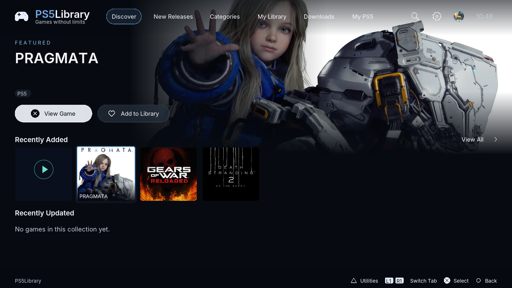
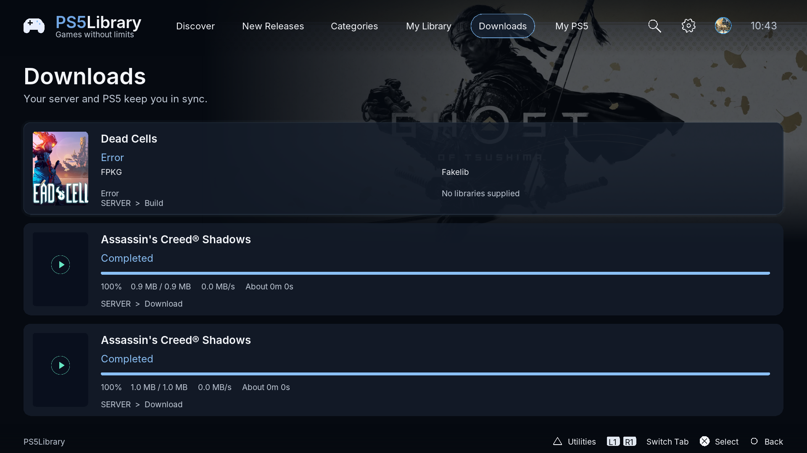
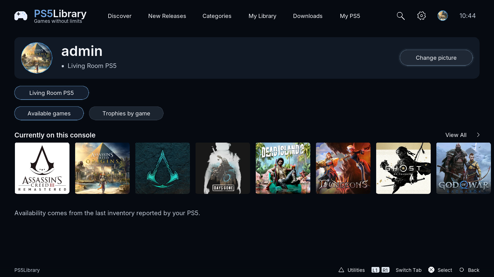

<p align="center"></p>

# PS5Library

A native, controller-first storefront for a self-hosted PS5 library.

Browse cover artwork, explore games, manage your console library, and follow real
download progress. Designed for your own dumps, homebrew, private repositories,
and other content you are authorized to use.

**Engineering preview.** This repository contains the PS5 frontend, console-side
client code, installer, tests, and build workflow. A separately hosted PS5Library
server is required; the server and its data are not included here.

[Download ELF releases](https://github.com/rdiol12/PS5Library/releases)
· [Build status](https://github.com/rdiol12/PS5Library/actions/workflows/elf.yml)

## Features

- Cinematic Discover screen, artwork rails, game details, search, and categories.
- Controller navigation, account/profile screens, and persistent console pairing.
- Separate views of server packages and games reported by console inventory.
- Storage selection, supported title launching, and real job/transfer progress.
- Cached artwork, supplied game music, and trailers after five seconds of focus.
- Capability negotiation and signed updates from your configured server.
- Firmware saved at registration, with an explicit refresh in My PS5.
- Exact backport profile selection, missing-file warnings and verified placement.

Version 0.2.10 lets you choose the installation method before selecting storage.
This fixes a dead end when the default FPKG route cannot use the selected drive:
ShadowMount remains reachable for supported USB/M.2 destinations. Compatibility
profiles and free-space checks still apply. Native package installation currently
supports PS5 base games on internal storage; native update/DLC installation is pending.

The previous startup and updater corrections are retained: IPMI loads before
AppInstUtil, built ELF dependencies are checked, and an empty update feed parses correctly.

The storefront follows the approved dark cinematic
reference: Inter typography, translucent controls, a larger hero composition,
clean controller icons and a consistent profile page. Search's View All retains
the selected results. Fonts and their license are bundled for offline startup.

The app needs the matching private server APIs (firmware, backport and
native-download APIs). A 4.51 system can carry a libc SDK baseline labelled 4.50;
the registration measurement now uses the system software API and rejects
conflicting version reports. Host checks cover that distinction; hardware
confirmation remains required.

Availability depends on the connected server and the console's actual runtime.
PS5Library is independent of Sony infrastructure and does not request PSN credentials.

## Screenshots

Captured from version 0.2.10 running on the development PS5 at 1920×1080,
using its paired server and actual library data. Downloads shows completed source
jobs and a failed preparation from that library.

### Discover



### Downloads



### Profile



## Install

1. Start a compatible jailbreak and homebrew loader on your PS5.
2. Download **`ps5library-install.elf`** from a release.
3. Send that installer through your compatible payload loader. It installs the
   frontend/assets and requests the supported homebrew title registration path.
4. Open PS5Library, enter your server address, and complete console pairing.

`ps5library.elf` is the application itself; **`ps5library-install.elf` is the file
for installation or updating**. The launcher integration currently uses the
compatible local homebrew launcher/websrv path. A standalone native title package
is not implemented.

The server address is configured at first launch, not compiled into the app.
Keep the release's `SHA256SUMS` to verify downloaded files. GitHub releases are
downloads; in-app updates still come from your configured server and require a
trusted signed update envelope.

## Build

Requires Git and Docker with Linux containers. The verified development setup is
Windows with Docker Desktop running Linux x86-64 containers.

```sh
git clone https://github.com/rdiol12/PS5Library.git
cd PS5Library
docker build -t ps5library-build -f docker/ps5-build.Dockerfile .
docker run --rm --network none -v "${PWD}:/workspace" ps5library-build bash scripts/build.sh
```

The same Docker commands work in PowerShell. The Docker build downloads the
public PS5 payload SDK **v0.43** and ports **v0.40.2**, verifying their SHA-256
digests. The application build runs without network access.

`scripts/build.sh` builds the desktop test targets, runs the native tests,
cross-compiles the PS5 frontend/installer, and checks the ELF files and metadata.
Results appear in `dist/`:

| File | Purpose |
| --- | --- |
| `ps5library-install.elf` | Install/update the frontend and its assets |
| `ps5library.elf` | Application binary |
| `ps5library-install.elf.json` | Version, build and integrity metadata |
| `SHA256SUMS` | Download integrity checks |

The public update verification key is in `ps5/assets/update-public-key.pem`.
Its private key is not included. Builds for a different update publisher must
use that publisher's public key and matching signed manifests.

## Automated releases

GitHub Actions builds/tests main-branch pushes, pull requests, and manual runs.
Push a version tag matching `ps5/common/version.hpp` to publish the verified ELF
files as a prerelease:

```sh
git tag v0.2.10
git push origin v0.2.10
```

For subsequent releases, update the application version and increase its build
number first. Tagged releases also include the dependency sources, upstream
patches/build recipes, and license notices needed for redistribution. Source
downloads are pinned by hash in `licenses/sources.json`.

## Current limitations

- Development targets a user-reported **4.51** console. Support for every
  jailbreakable firmware has not been verified; features are negotiated at runtime.
- Host tests and cross-compilation do not prove physical-console behavior.
- HDMI audio remains inaudible on the tested console despite successful audio calls.
- PS-button **Home/background** behavior remains unresolved.
- Native PS5 base-package downloads use the AppInstUtil URL installer when it
  initializes successfully. Native queue appearance and acceptance on physical
  hardware remain unverified. The first adapter confirms internal installs;
  external targets, native update/DLC installation and automatic native error
  polling are not implemented. Use PS5 Downloads for its queue controls/errors.
- ShadowMount 1.7 overlays use verified staging and separate title directories;
  FPKG backport variants contain their selected libraries inside the package.
  These runtime paths require matching server profiles and physical launch tests.
- The app does not claim completion from an accepted install request: installed
  package bytes, exact title metadata and server inventory must agree.
- Standalone persistent-agent/background support and direct native title startup
  are not established. Existing launcher integration remains required.

## Source layout

```text
ps5/frontend/    Store UI, input, artwork, audio and video
ps5/common/      API client, configuration and signed-update verification
ps5/agent/       Console discovery, inventory and transfer-related client code
ps5/installer/   Installer and asset publication
ps5/assets/      PS5Library branding and launch assets
ps5/tests/       Native checks and hardware diagnostic source
scripts/        Build, packaging and release checks
docker/         Pinned PS5 build environment
```

No server implementation, account database, private credentials, diagnostic logs,
game dumps, or game media are published in this repository.

## License

Original PS5Library console code: **GPL-3.0-or-later**. Dependencies retain their
own copyrights and licenses. See [LICENSE](LICENSE) and [NOTICE.txt](NOTICE.txt).
